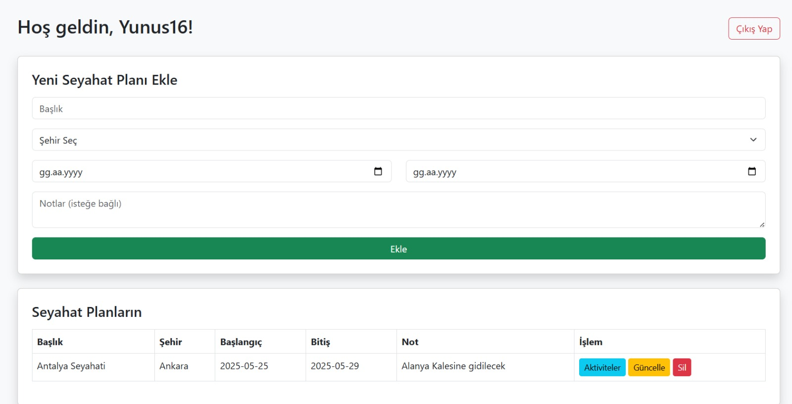
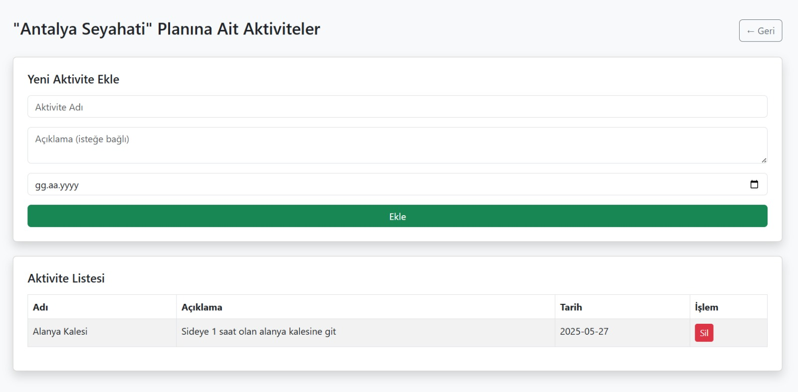

#  Kişisel Seyahat Planlayıcı Web Uygulaması

Bu proje, kullanıcıların kendi seyahat planlarını oluşturmalarına, şehir seçip tarih belirlemelerine ve bu seyahatlere özel aktiviteler ekleyip yönetmelerine olanak tanıyan sade bir PHP tabanlı web uygulamasıdır.

Kullanıcılar bu sistem aracılığıyla:
- Üyelik oluşturabilir,
- Giriş yaparak kendi özel paneline erişebilir,
- Seyahat planları ekleyebilir (şehir, tarih, açıklama),
- Planlara özel aktiviteler tanımlayabilir (örneğin "Müze gezisi", "Otobüs bileti", vs.),
- Var olan planlarını görüntüleyebilir, düzenleyebilir veya silebilir.

## 🛠 Kullanılan Teknolojiler

-  PHP 
-  MySQL (phpMyAdmin üzerinden)
-  HTML5 + CSS
-  Bootstrap 5 
-  XAMPP ortamında çalıştırılmak üzere yapılandırılmıştır

## 🔐 Kullanıcı İşlemleri

-  Kayıt Ol 
-  Giriş Yap / Çıkış Yap
-  Oturum yönetimi 

##  Önemli Özellikler

**Seyahat Planları İçin:**
- Create: Yeni plan ekleme
- Read: Planları listeleme
- Update: Plan güncelleme
- Delete: Plan silme

**Aktiviteler İçin:**
- Create: Aktivite ekleme
- Read: Listeleme
- Delete: Aktivite silme

## 🧾 Veritabanı

Veritabanı oluşturma komutları veritabani.sql dosyasında yer almaktadır.  
PhpMyAdmin → SQL sekmesinden çalıştırarak tablo yapısını kolayca kurabilirsiniz.

## 🖼 Ekran Görüntüleri

Aşağıda projeye ait bazı ekran görüntüleri yer almaktadır:

>  **Register Ekranı**  
> 

>  **Login Ekranı**  
> 

>  **Dashboard**  
> 

>  **Aktivite Sayfası**  
> 

---

## Youtube Linki

- Link------> https://youtu.be/IWoJDUiJpg8

🔗 **Canlı Hosting Linki:**  
[http://95.130.171.20/~st22360859079/](http://95.130.171.20/~st22360859079/login.php)

💻 **GitHub Repo Linki:**  
[https://github.com/YunS16/Kisisel-Seyahat-Planlayicisi](https://github.com/YunS16/Kisisel-Seyahat-Planlayicisi)

## 📚 Önemli Notlar

- Framework kullanılmamıştır
- Her şey yalın PHP ile geliştirilmiştir
- Kullanıcı dostu ve düzenli klasör yapısına sahiptir

---

##  Geliştirici
 Yunus Emre Nallı  
 [yunusemrenalli8@gmail.com]  

